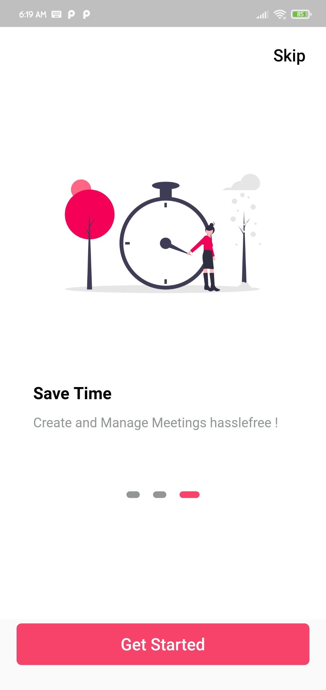

# Calendlio (Made with ❤ using Flutter ) :tada:
A simple app made using flutter and dart to assist you manage / schedule your personal meetings hassle free .

## Demo
Demo of the running App <br/>


## How to setup and build project
To build the project onto your local machine simply clone the repo and follow the instructions
```
git clone https://github.com/avijeetpande/calendlio.git

cd calendlio

flutter pub get

flutter run
```

These steps will build and launch the project into your device / emulator

## Features 
- Full User Authentication ( User can register and signup )
- User can create new Meetings
- User can view the created meetings

### App UI ( Onboarding + Screens)
**Onboarding Screens**<br>




**App Screens**<br>
 


**Meeting Board**<br>


